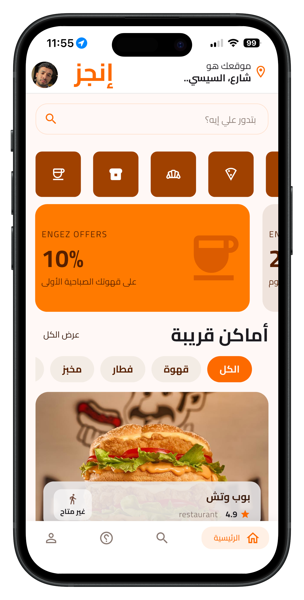
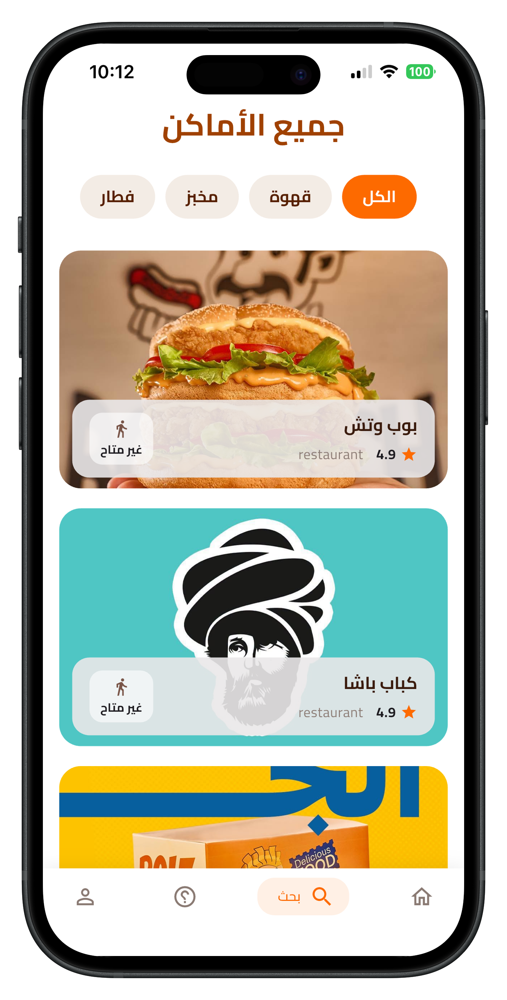
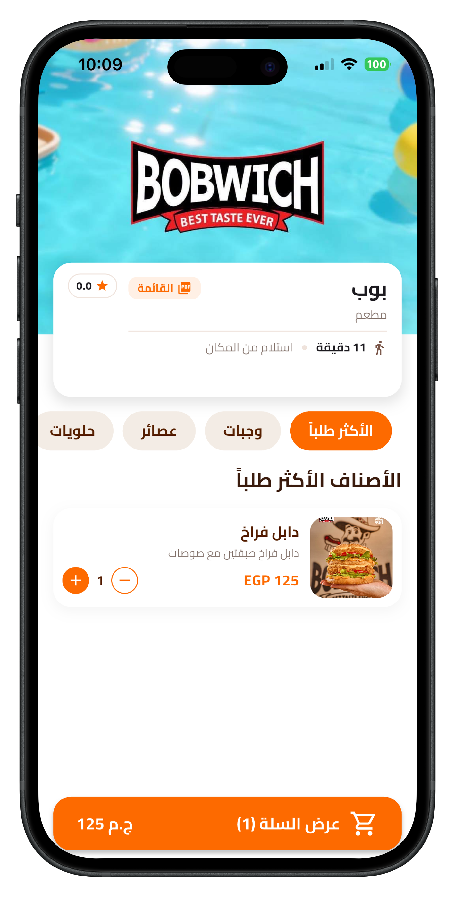
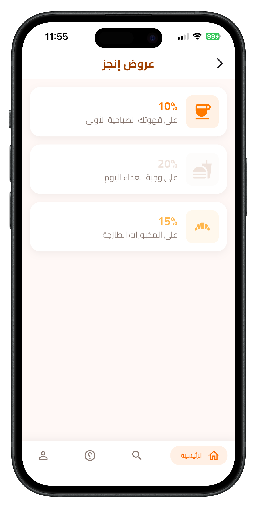
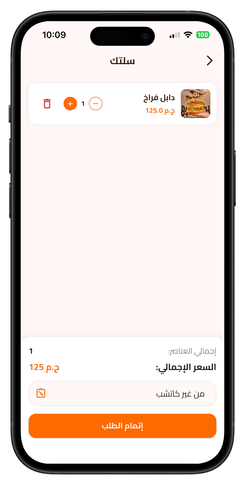
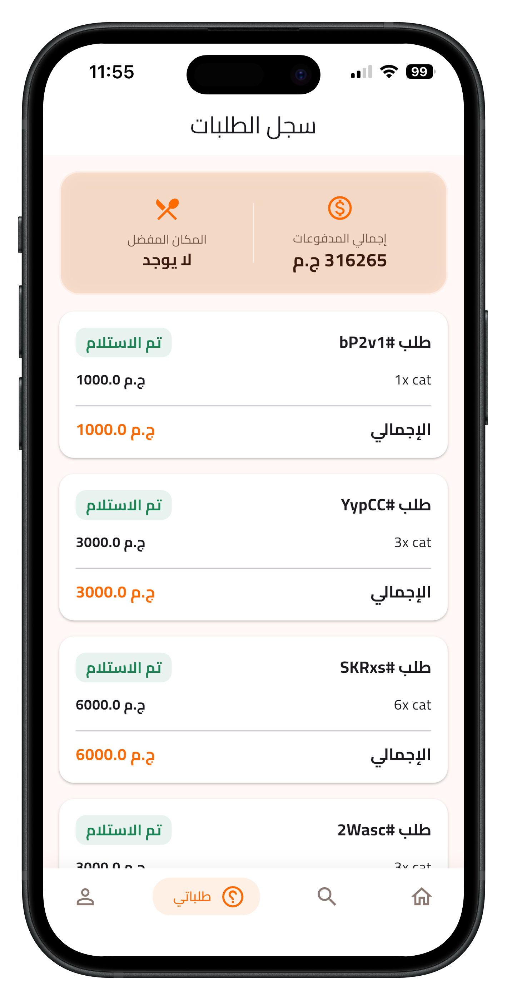
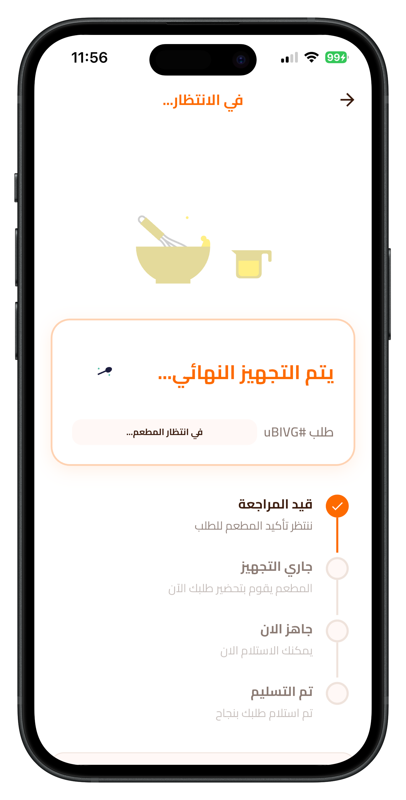
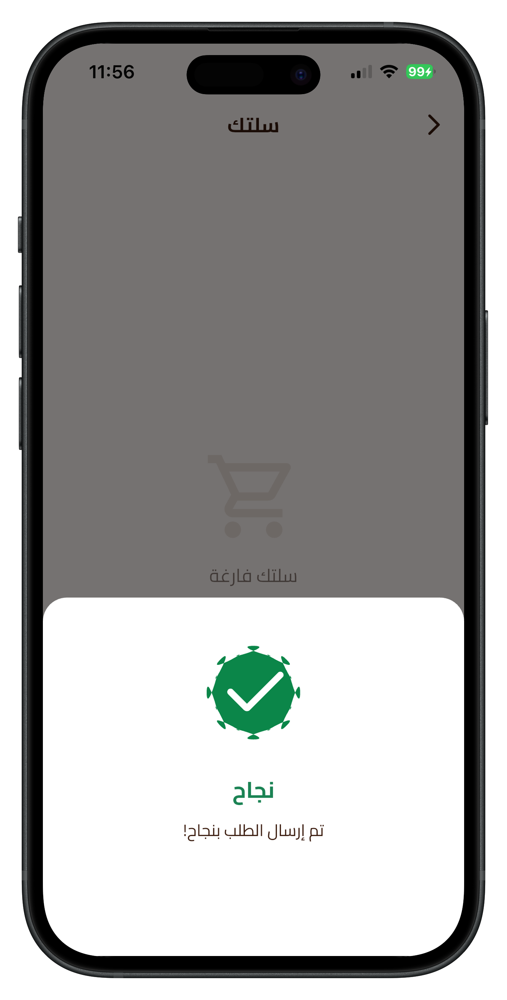
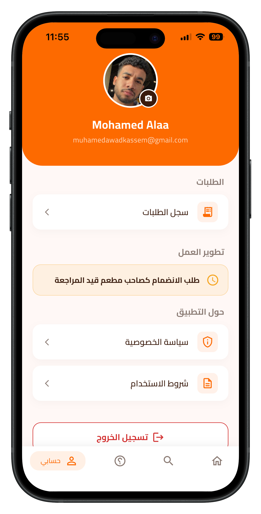

# Engez (إنجز) 🚀


**Engez** is a modern, high-performance Flutter application designed to eliminate waiting lines in restaurants and cafes through an efficient **Order Ahead & Pick-up** system. Users can order their food or coffee while on the go, and simply pick it up upon arrival—saving valuable time!

## 🎥 App Demo Video

> **Watch the full app experience in action:**
> *(Place your video link here, e.g., YouTube or LinkedIn)*
> 
> `<a href="YOUR_VIDEO_LINK_HERE" target="_blank"></a>`

---

## 🌟 Key Features

* **Order Ahead & Save Time:** Seamless, real-time connection between the customer and the restaurant to prepare orders before arrival, completely eliminating crowds and wait times.
* **Smart Cart:** A dynamic, advanced cart system that allows users to easily add items, adjust quantities, and calculate totals in real-time.
* **Interactive PDF Menus:** Integrated an advanced PDF viewer within a sleek Glass Blur pop-up design for a premium, interactive menu browsing experience.
* **Lightning-Fast Performance:** Instantaneous UI updates and flawless interactions powered by robust state management (BLoC/Cubit) with zero lag.
* **Dedicated Owner Dashboard:** A completely separate flow for restaurant owners to manage incoming orders, track statuses, and seamlessly add/edit their menu items with a beautiful Grid and Bottom Sheet UI.

---

## 📱 Screenshots

### Customer Flow

| Home | Search & Filter | Place Details |
| :---: | :---: | :---: |
|  |  |  |

| Offers & Categories | Smart Cart / Add Note | My Orders |
| :---: | :---: | :---: |
|  |  |  |

| Order In Progress | Order Done | Profile |
| :---: | :---: | :---: |
|  |  |  |

---

## 🛠️ Tech Stack & Architecture

* **State Management:** Fully relies on **BLoC (Cubit)** to handle business logic, completely decoupled from the UI for optimal **Clean Code** architecture.
* **Backend Integration:** Deeply integrated with **Firebase** ecosystem:
  * **Firebase Authentication:** Phone Number (OTP) and Google Sign-in.
  * **Cloud Firestore:** Real-time NoSQL database for managing users, places, menus, and syncing order statuses instantly across devices.
  * **Firebase Storage:** Handling image uploads for users and restaurant menu items.
* **Routing:** `go_router` for advanced, declarative navigation.
* **UI/UX:** `flutter_screenutil` for extreme responsiveness, `skeletonizer` for modern shimmer loading effects, and custom `Google Fonts` (Cairo) for Arabic typography.

## 📁 Project Structure (Feature-First)

```text
lib/
├── main.dart
├── router/
│   └── app_router.dart            # GoRouter configuration
├── core/
│   └── theme/                     # Global theming & styles
├── constants/
│   └── my_colors.dart             # Unified color palette
├── features/
│   ├── auth/                      # Authentication & Role Selection
│   ├── home/                      # Main customer feed & Discovery
│   ├── place/                     # Restaurant details & menus
│   ├── menu/                      # Menu items & PDF viewer
│   ├── cart/                      # Smart Cart management
│   ├── order/                     # Order history, tracking, & owner management
│   ├── owner/                     # Owner dashboard & sales reports
│   └── profile/                   # User profiles & settings
└── widgets/                       # Highly reusable global UI components
```

## 🚀 Setup & Installation

### Requirements
- Flutter SDK (`>=3.0.0`)
- A Firebase project linked to your package name.

### Run Steps

1. **Clone the repository**
2. **Install dependencies:**
   ```bash
   flutter pub get
   ```
3. **Configure Firebase:**
   Ensure `firebase_options.dart` is correctly generated for your project using FlutterFire CLI:
   ```bash
   flutterfire configure
   ```
4. **Run the app:**
   ```bash
   flutter run
   ```

---
*Built with ❤️ to redefine the dining experience.*